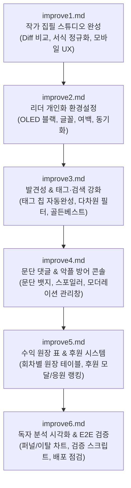

# 작가 친화 기능 고도화 로드맵 종합 계획서 (improve.md)

## 1. 추진 배경 및 개요
본 문서는 `todevelop.md`의 '작가 친화 기능 고도화 개발 계획서'를 바탕으로, 현재 70~75% 달성된 핵심 기반(초안 저장, 태그/검색, 골든베스트, 문단댓글/악플방어, 리더이벤트, 후원) 위에 **실제 서비스 운영 수준의 완성도와 사용자 경험을 갖추기 위한 6단계 세부 개발 명세**를 정의합니다.

---

## 2. 6단계 개발 로드맵 구조 및 단계별 목표

| 단계 파일 | 단계 명칭 | 핵심 목표 및 주요 산출물 |
| :--- | :--- | :--- |
| **[improve1.md](file:///d:/Antigravity/webnovels/improve1.md)** | **1단계: 작가 집필 스튜디오 완성** | • 버전 간 시각적 Diff 비교 모달 • 웹소설 전용 서식/단락 정규화 도구 • 모바일 집필 키보드/하단 툴바 최적화 |
| **[improve2.md](file:///d:/Antigravity/webnovels/improve2.md)** | **2단계: 리더 개인화 환경설정** | • OLED True Black 테마 탑재 • 명조/고딕 글꼴 및 줄간격/여백 조절 UI • `reader_preferences` DB 및 기기 간 동기화 |
| **[improve3.md](file:///d:/Antigravity/webnovels/improve3.md)** | **3단계: 발견성 & 태그·검색 강화** | • 표준 태그 자동완성 칩(Chips) 입력기 • 탐색(Discover) 복수 태그/완결/회차수 다차원 필터 UI • Golden Best 랭킹 및 신인 추천 사유 뱃지 연동 |
| **[improve4.md](file:///d:/Antigravity/webnovels/improve4.md)** | **4단계: 문단 댓글 & 악플 방어 콘솔** | • 뷰어 본문 문단별 댓글 카운트 뱃지/필터링 • 스포일러 가림/펼침 UX 고도화 • 작가 전용 댓글 모더레이션 관리 패널/모달 |
| **[improve5.md](file:///d:/Antigravity/webnovels/improve5.md)** | **5단계: 수익 원장 표 & 후원 시스템** | • 회차별 세부 수익 원장(Ledger) 데이터 테이블 UI • 독자 포인트 후원(Support) 전용 모달 & 오늘의 후원자 명단 • 정산 원장 실시간 집계 연동 |
| **[improve6.md](file:///d:/Antigravity/webnovels/improve6.md)** | **6단계: 독자 분석 시각화 & 검증** | • 회차별 독서 퍼널(1화→3화→최신화) 및 이탈률 차트 • 종합 통합 테스트 스크립트(`verify_author_suite.ts`) • 최종 빌드 및 프로덕션 호환성 검증 |

---

## 3. 개발 및 진행 원칙
1. **기존 안정성 유지**: 이미 정상 구동 중인 작가 스튜디오, 관리자 CMS, Supabase DB 통신을 파괴하지 않고 외과적으로 확장합니다.
2. **반응형 모바일 우선(Mobile-First)**: 모바일 뷰어와 모바일 집필 환경(폭 768px 이하)에서의 터치 타깃(44px 이상)과 가상 키보드 가림 현상을 철저히 방어합니다.
3. **단계별 검증 완료 후 다음 단계 착수**: 각 단계 문서에 기술된 검증 체크리스트를 통과한 후 순차적으로 다음 단계로 진행합니다.
